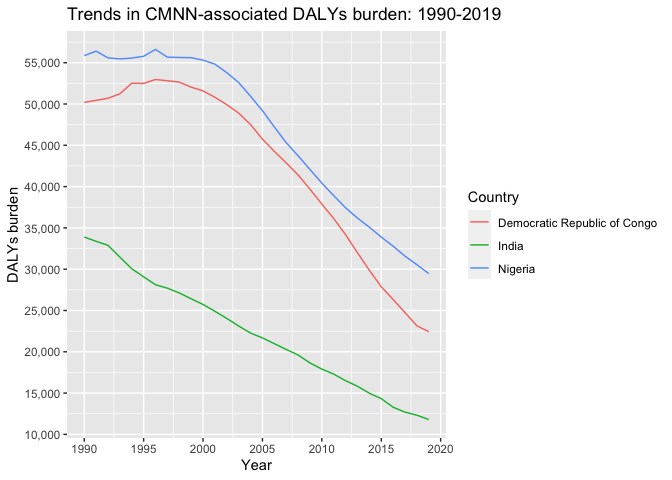
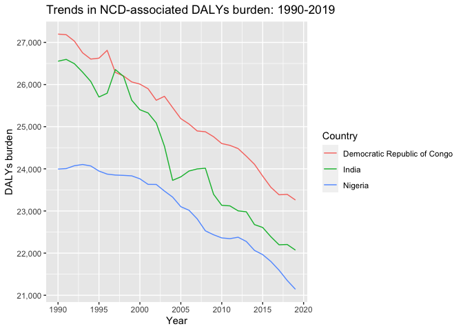

Global Disease Burden Analysis
================
Manjari Shankar

# Introduction

This document compares the Disability-Adjusted Life Year (DALY) diseases
burden for three countries: COUNTRY 1, COUNTRY 2, and COUNTRY 3. We
compare the burden due to communicable, maternal, neonatal, and
nutritional diseases (CMNN), non-communicable diseases (NCDs), and
overall disease burden for these countries.

The source data is from the Institute for Health Metrics and Evaluation
(IHME) Global Burden of Disease (GBD) study.

# Communicable, Maternal, Neonatal, and Nutritional Disease Burden (CMNN)

## Table of Estimates for CMNN Burden Over Time

| Year | Democratic Republic of Congo |  India   | Nigeria  |
|:----:|:----------------------------:|:--------:|:--------:|
| 1990 |           50196.34           | 33895.90 | 55858.01 |
| 1991 |           50443.96           | 33375.63 | 56402.61 |
| 1992 |           50693.67           | 32893.75 | 55584.80 |
| 1993 |           51233.83           | 31463.62 | 55462.25 |
| 1994 |           52523.22           | 30056.13 | 55563.10 |
| 1995 |           52491.90           | 29081.08 | 55778.38 |
| 1996 |           52969.64           | 28119.10 | 56608.97 |
| 1997 |           52813.36           | 27700.58 | 55670.89 |
| 1998 |           52652.06           | 27128.22 | 55633.69 |
| 1999 |           52042.97           | 26415.00 | 55610.97 |
| 2000 |           51583.70           | 25728.70 | 55309.83 |
| 2001 |           50815.61           | 24907.14 | 54828.09 |
| 2002 |           49919.95           | 24039.62 | 53795.58 |
| 2003 |           48902.14           | 23118.65 | 52594.17 |
| 2004 |           47509.86           | 22267.72 | 50933.61 |
| 2005 |           45749.35           | 21683.08 | 49195.49 |
| 2006 |           44265.18           | 20985.53 | 47222.66 |
| 2007 |           42869.31           | 20284.67 | 45320.76 |
| 2008 |           41411.29           | 19615.25 | 43735.33 |
| 2009 |           39688.13           | 18650.45 | 42069.10 |
| 2010 |           37886.04           | 17907.34 | 40429.09 |
| 2011 |           36130.99           | 17295.99 | 38900.83 |
| 2012 |           34169.94           | 16497.53 | 37432.21 |
| 2013 |           31988.10           | 15829.94 | 36186.87 |
| 2014 |           29871.29           | 14983.53 | 35085.94 |
| 2015 |           27869.53           | 14332.53 | 33891.85 |
| 2016 |           26335.87           | 13288.66 | 32791.92 |
| 2017 |           24742.63           | 12696.29 | 31579.39 |
| 2018 |           23145.97           | 12319.55 | 30540.72 |
| 2019 |           22429.73           | 11801.44 | 29467.82 |

## Plot Showing Trends in CMNN Burden Over Time

<!-- -->

## Summary of CMNN Burden Findings

> The DALYs accrued due to Communicable, Maternal, Neonatal, and
> Nutritional diseases between 1990 and 2019 across the 3 select
> countries of DRC, Nigeria and India varies considerably. All three
> countries show a peak in the year 1999 with a downward trend ever
> since. While India started with the lowest baseline, all 3 countries
> have downward trajectories with likely convergence over the next
> decade.

# Non-Communicable Disease Burden (NCD)

## Table of Estimates for NCD Burden Over Time

| Year | Democratic Republic of Congo |  India   | Nigeria  |
|:----:|:----------------------------:|:--------:|:--------:|
| 1990 |           27197.63           | 26554.09 | 23994.43 |
| 1991 |           27182.46           | 26596.63 | 24005.55 |
| 1992 |           27030.25           | 26494.62 | 24073.41 |
| 1993 |           26753.36           | 26294.26 | 24103.21 |
| 1994 |           26604.35           | 26072.98 | 24068.17 |
| 1995 |           26626.30           | 25704.34 | 23947.07 |
| 1996 |           26811.70           | 25794.08 | 23875.00 |
| 1997 |           26288.57           | 26355.52 | 23852.26 |
| 1998 |           26203.71           | 26193.81 | 23844.55 |
| 1999 |           26062.03           | 25628.72 | 23833.43 |
| 2000 |           26011.04           | 25402.28 | 23763.60 |
| 2001 |           25900.36           | 25326.27 | 23631.43 |
| 2002 |           25627.26           | 25087.93 | 23629.69 |
| 2003 |           25720.73           | 24536.36 | 23472.64 |
| 2004 |           25453.63           | 23726.90 | 23329.15 |
| 2005 |           25191.03           | 23809.74 | 23101.87 |
| 2006 |           25064.24           | 23947.92 | 23016.59 |
| 2007 |           24898.60           | 23997.51 | 22813.20 |
| 2008 |           24879.73           | 24014.73 | 22528.84 |
| 2009 |           24762.25           | 23396.45 | 22435.62 |
| 2010 |           24600.15           | 23134.68 | 22360.91 |
| 2011 |           24556.86           | 23120.89 | 22343.36 |
| 2012 |           24480.47           | 23002.85 | 22376.80 |
| 2013 |           24300.22           | 22981.07 | 22276.31 |
| 2014 |           24107.21           | 22676.67 | 22064.38 |
| 2015 |           23827.81           | 22608.59 | 21964.47 |
| 2016 |           23563.02           | 22389.00 | 21802.05 |
| 2017 |           23384.56           | 22197.81 | 21594.53 |
| 2018 |           23393.75           | 22204.26 | 21350.80 |
| 2019 |           23259.95           | 22071.57 | 21141.61 |

## Plot Showing Trends in NCD Burden Over Time

<!-- -->

## Summary of NCD Burden Findings

All the 3 select countries are exhibiting a downward trend in DALYs due
to NCDs. While the peak was around the 2000s, India has seen a brief
upward trend between 2004 and 2008. NCDs have been a significant public
health problem in low and lower-middle income countries and this graph
can be attributed to the ongoing effports to control this across this
country segment.

# Overall Disease Burden

    ## Rows: 8100 Columns: 4
    ## ── Column specification ────────────────────────────────────────────────────────
    ## Delimiter: ","
    ## chr (2): Entity, Code
    ## dbl (2): Year, DALYs (Disability-Adjusted Life Years) - All causes - Sex: Bo...
    ## 
    ## ℹ Use `spec()` to retrieve the full column specification for this data.
    ## ℹ Specify the column types or set `show_col_types = FALSE` to quiet this message.

## Table of Estimates for Overall Disease Burden Over Time

## Plot Showing Trends in Overall Disease Burden Over Time

## Summary of Overall Disease Burden Findings

Provide a brief analysis based on the data presented in the table and
chart. Highlight any significant findings or patterns. About 3
sentences.
